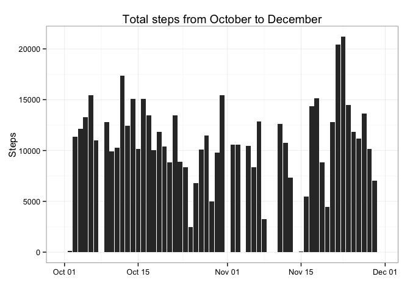
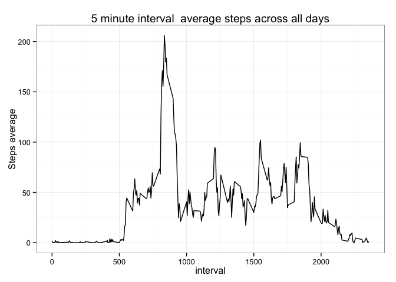
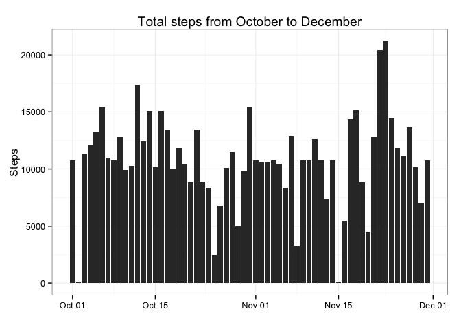
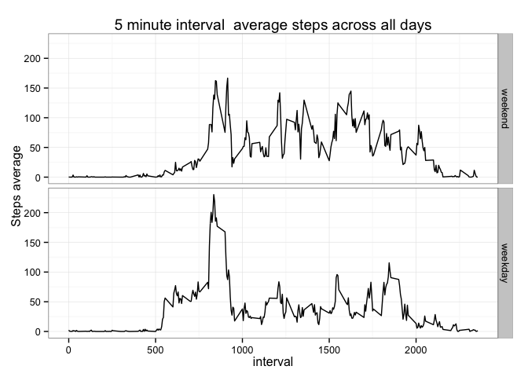

# Reproducible Research : Peer Assessment 1
Fran Martinez  
17 October 2015  

### Introduction

In this study will use data from a group of people interested in knowing about themselves regularly to improve their health or to found patterns in their behavior. Particularly we will use data from an individual collected in the months of October and November, 2012 and include the number of steps taken in 5 minute intervals each day.

The variables included in this data set are:

* steps: Number of steps taking in a 5-minute interval (missing values are coded as NA)
* date: The date on which the measurement was taken in YYYY-MM-DD format
* interval: Identifier for the 5-minute interval in which measurement was taken

### Loading and preprocessing the data

We will first load the data from the working directory and convert It to a tabular data frame and convert the date variable to date type.


```r
library(dplyr)
library(lubridate)
library(ggplot2)
library(timeDate)

df <- tbl_df(read.csv("./activity.csv"))
df$date <- ymd(df$date)
```

### What is mean total number of steps taken per day?

Next we want to group the data by date so we can sum up the total steps for each day. Notice the `%>%` operator. Is used to serve as a pipe operator that transports the output from the left to the first argument of the function to the right of It.  


```r
group.date <- df %>% group_by(date) %>% 
              summarise(total = sum(steps, na.rm = TRUE))
```

And plot total steps for every interval across all days. 


```r
w <- qplot(group.date$date, group.date$total,
      geom = "bar", 
      stat = "identity",
      main = "Total steps from October to December",
      xlab = "", 
      ylab = "Steps")
w + theme_bw()
```

 

Then we are asked to calculate the mean and the median of total number of steps taken per day  


```r
mean(group.date$total); median(group.date$total)
```

```
## [1] 9354.23
```

```
## [1] 10395
```

### What is the average daily activity pattern?

Now we are going to plot the number of steps for each 5 minutes interval averaged across all days. First we filter to get rid of missing values in `steps` variable, then we group by interval and summarize calculating the mean for each one.   


```r
group.interval <- df %>% filter(!is.na(steps)) %>%
              group_by(interval)  %>% 
              summarise (mean_steps = mean(steps))
```
Finally we plot the mean of the steps vs the interval to get a time series plot.   

```r
ggplot(group.interval, aes(interval, mean_steps, group = 1)) + 
       geom_line() +
       theme_bw() +
       labs(x = "interval", 
            y = "Steps average",
            title = "5 minute interval  average steps across all days")
```

 

To calculate which interval has the maximum average number of steps we can do

```r
group.interval$interval[which.max(group.interval$mean_steps)]
```

```
## [1] 835
```
And to know the average 

```r
group.interval$mean_steps[which.max(group.interval$mean_steps)] 
```

```
## [1] 206.1698
```

### Imputing missing values

There are a number of days/intervals where there are missing values (coded as NA). The presence of missing days may introduce bias into some calculations or summaries of the data. We want to compute the number of missing values in the data set.


```r
sum(!complete.cases(df))
```

```
## [1] 2304
```

Now we want a smart strategy to fill the missing values in a way that we do not change the overall stats of the entire data frame. Our approach is to compute the mean of every 5-minute interval across all days and fill in the gaps with those values for each different case.  We first create a new column with the mean of the steps, and then we fill the missing values using standard data frames notations and `is.na`function coppying them from the new `mean_steps`variable. Finally we recalculate the total steps. 


```r
group.interval.c <- df %>% group_by(interval) %>%
              mutate(mean_steps = mean(steps, na.rm = TRUE))
  
group.interval.c[is.na(group.interval.c$steps),]$steps <- group.interval.c[is.na(group.interval.c$steps),]$mean_steps 

group.date.steps <- group.interval.c %>% group_by(date) %>% 
  summarise(total_steps = sum(steps, na.rm =TRUE))
```

And plot the histogram


```r
q <- qplot(group.date.steps$date, group.date.steps$total_steps,
      geom = "bar",
      stat = "identity",
      main = "Total steps from October to December",
      xlab = "", 
      ylab = "Steps")
 q + theme_bw()
```

 

Now we can compare the mean and median to previous numbers

```r
 mean(group.date.steps$total_steps); median(group.date.steps$total_steps)
```

```
## [1] 10766.19
```

```
## [1] 10766.19
```
 
### Are there differences in activity patterns between weekdays and weekends?
 
Now we want to distinguish between weekdays and weekends. We will do that by using `isWeekday` from {dateTime} for label days as weekdays or weekend. Pay attention at levels order. Then we group by interval and weekday and summarise the mean again. 
 

```r
group.interval.c$weekdays <- factor(isWeekday(group.interval.c$date), labels = c("weekend", "weekday")) 

group.interval.weekdays <- group.interval.c %>% group_by(interval, weekdays) %>%
               summarise(steps_mean = mean(steps))
```
Finally we can plot the two figures

```r
ggplot(group.interval.weekdays, aes(interval, steps_mean, group = 1)) + 
  geom_line() +
  theme_bw() +
  facet_grid(weekdays ~ .) +
  labs(x = "interval", 
       y = "Steps average",
       title = "5 minute interval  average steps across all days")
```

 


 
 
 
 
